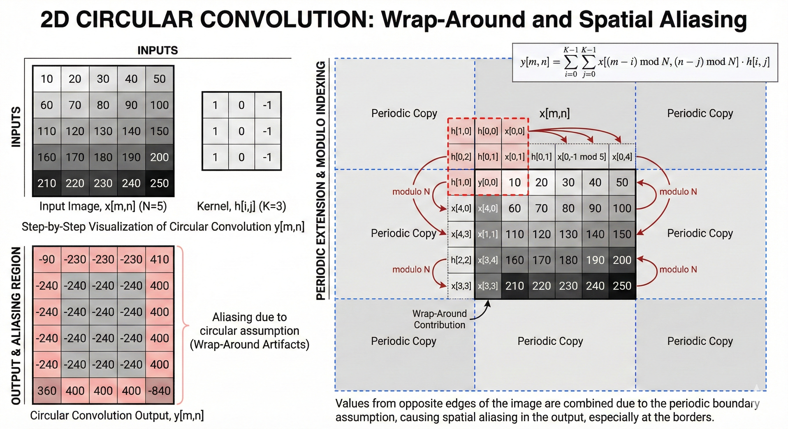
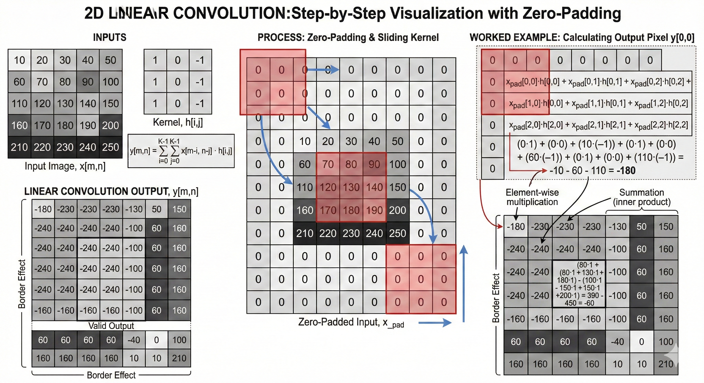

# Linear vs Circular Convolution

---

## What is Circular Convolution?

Fourier deals with the signal as a **periodic signal**.  
So the end of the signal will come back to the beginning.  
That is what we call **wrapping**, and this wrapping causes what is called:

> **Aliasing**

### Mathematically (for length N signals):

$$y[n] = \sum_{k=0}^{N-1} x[k] \cdot h[(n - k) \mod N]$$

Notice the modulo $\mod N$,this is what makes it **circular**.

---

## How Does the Image Look in Circular Convolution?

Because Fourier assumes periodicity:

- The **right edge** appears again on the left.
- The **bottom** appears again on the top.

So the image is treated as an **infinite periodic repetition**, not a finite piece.

DFT does not see the image as a finite matrix. It sees it as:

$$\ldots \text{ periodic image} * \text{periodic kernel} \ldots$$

This causes **overlapping at the boundaries**.

---

## Why Do We Get Circular Convolution Using FFT?

Because:

$$\text{DFT}(x) \cdot \text{DFT}(h)$$

after inverse DFT gives:

$$x[n] \circledast h[n]$$

which is **circular convolution**, not linear.

So:

$$\text{DFT}(x) \cdot \text{DFT}(h) = \text{Circular Convolution}$$

The reason is again: **Fourier assumes the signal is periodic**.

---

## What is Linear Convolution?

When the convolution result length is:

$$N + M - 1$$

We call it **Linear Convolution**, where:

- $N$ = input length (or input height in image)
- $M$ = kernel length (or kernel height)

### Mathematically:

$$y[n] = \sum_{k=0}^{M-1} x[k] \cdot h[n - k]$$

There is **no wrapping** here. At the edges:

- We add **zeros**.
- The signal does **not** wrap.
- The result **expands**.

That is why the output becomes $N + M - 1$.

---

## Why Circular Convolution Causes Aliasing?

We can say:

$$\text{Circular Convolution} = \text{Linear Convolution} + \text{Aliasing}$$

Because the wrapped part **overlaps** with the valid result.  
So the overlapping (due to periodic assumption) **is** the aliasing.

---

## How Do We Solve It?

Simple! we expand the image using **Zero Padding**.

The padded length must be:

$$N + M - 1$$

Then:

$$\text{Circular Convolution (after padding)} = \text{Linear Convolution}$$

Because now the linear result fits inside **one period**, so no wrapping happens.

We can say:

> We subtract the aliasing by expanding the image.

---

## Final Intuition

- **DFT** always produces circular convolution.
- **Circular convolution** assumes periodic signals.
- **Periodicity** causes wrapping.
- **Wrapping** causes aliasing.
- **Zero padding** removes aliasing.
- When padding size $\geq N + M - 1$, we recover **linear convolution**.
